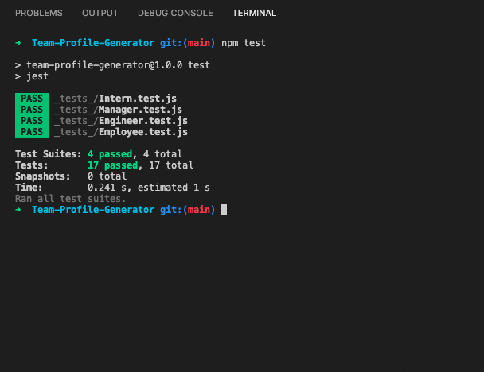

# Team Profile Generator

## Description
  This application allows users to generate a new team through answering a series of questions in the terminal. Once the user is done filling out the questions a new HTML and CSS file will generate in the dist folder. The user then can open the html in whichever browser they like to show the new generated team. 

## Table of Contents 

- [Installation](#installation)
- [Usage](#usage)
- [License](#license)
- [Contributing](#repo)
- [Credits](#credits)
- [Tests](#test)

## Installation
  NPM I for dependencies

## Usage
  
Include screenshots as needed.

## License

https://opensource.org/licenses/IPL-1.0

## Credits

[My GitHub: woodstr3313](https://github.com/woodstr3313)

[My email: woodstr3313@gmail.com](email:woodstr3313@gmail.com)

[My GitHub Repo](https://github.com/woodstr3313/Team-Profile-Generator)

Watch *[this video](https://drive.google.com/file/d/13Nm7C-DwHhNzY5Uy1aBkzGjwxMesjBr7/view)* to see the how to use this app.

## How to Contribute
  Please contact me at woodstr3313@gmail.com if you would like to contribute.

## Tests
NPM Test
